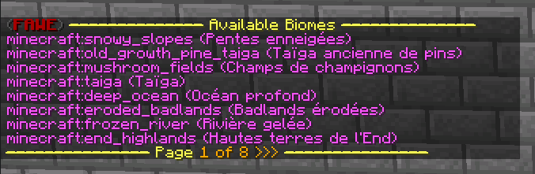
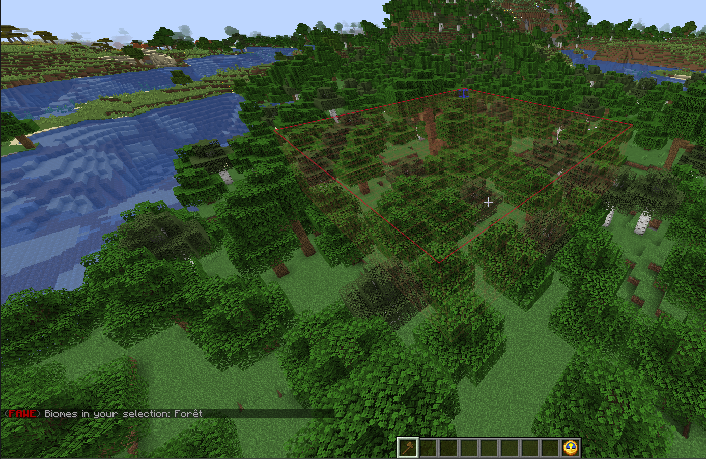
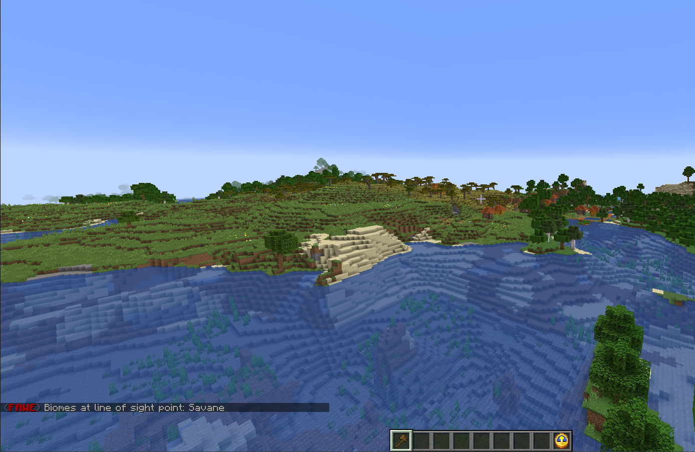
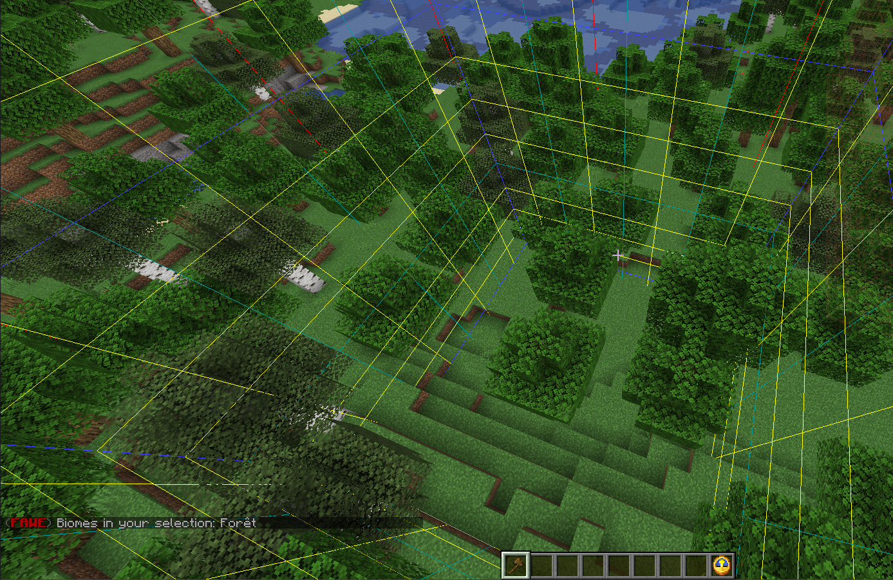
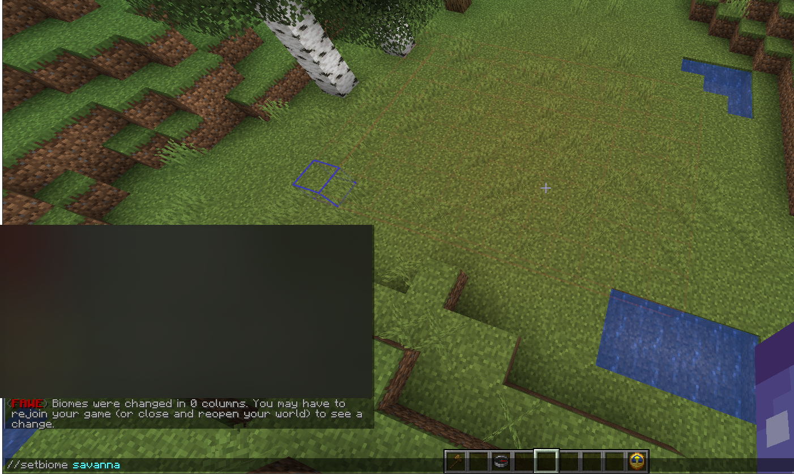

# Biome

Raccourcie

<table data-view="cards"><thead><tr><th align="center"></th><th align="center"></th><th align="center"></th></tr></thead><tbody><tr><td align="center">biomelist</td><td align="center"><code>//biomelist [-p &#x3C;page>]</code></td><td align="center">liste de biome</td></tr><tr><td align="center">biomeinfo</td><td align="center"><code>/biomeinfo [-p] [-t]</code></td><td align="center">

info biome
</td></tr><tr><td align="center">setbiome</td><td align="center"><code>//setbiome &#x3C;biome> [-p]</code></td><td align="center">définir un biome</td></tr></tbody></table>

## Biomelist

* La commande biomelist vous permet d'obtenir une liste de tous les biomes disponibles dans Bukkit.
* Utilisation `//biomelist [-p <page>]`

<figure><figcaption>
<code>//biomelist</code>
</figcaption></figure>

## Biomeinfo

* Biomeinfo est une commande qui affiche le biome actuel. Par défaut, vous obtenez une liste de tous les biomes dans votre sélection de région (image 1).&#x20;
* Si vous utilisez l'option `-p`, la commande affiche plutôt le biome du [chunk](https://minecraft.fandom.com/fr/wiki/Tron%C3%A7on) où vous êtes actuellement (image 2).&#x20;
* Si vous utilisez l'option `-t`, elle affiche le biome du bloc ciblé dans votre [viseur](https://minecraft.fandom.com/fr/wiki/Interface\_utilisateur#La\_croix) (image 3).


Les biomes sont indépendants de l'axe Y avant la version 1.16. A partir de la version 1.16 et suivantes, les biomes sont définis dans des sections de 4x4x4. Plus d'informations sur le nouveau format peuvent être trouvées [ici](https://wiki.vg/Protocol#Chunk\_Data).


* Utilisation `/biomeinfo [-p] [-t]`

<figure><figcaption>
Image n°1 <code>/biomeinfo</code>
</figcaption></figure>

<figure><figcaption>
Image n°2 <code>/biomeinfo -p</code>
</figcaption></figure>

<figure><figcaption>
Image n°3 <code>/biomeinfo -t</code>
</figcaption></figure>

## Setbiome

* Avec cette commande, vous pouvez changer le biome de votre sélection de région.&#x20;
* Par défaut, la commande modifie le(s) biome(s) de votre sélection (image 1).&#x20;
* Utilisez l'option `-p` pour ignorer la sélection et changer le biome à votre position actuelle (image 2).&#x20;


Les biomes sont indépendants de l'axe Y dans les versions _avant_ 1.16. A partir de la version 1.16 et ultérieure, les biomes sont définis par sections de 4x4x4. Plus d'informations (plutôt techniques) sur le nouveau format peuvent être trouvées [ici](https://wiki.vg/Protocol#Chunk\_Data).&#x20;


* Utilisation : `//setbiome <biome> [-p]`

<figure><figcaption>
Image n°1 <code>//setbiome &#x3C;biome></code>
</figcaption></figure>

<figure><figcaption>
 Image n°2 <code>//setbiome &#x3C;biome> -p</code>
</figcaption></figure>


site original

