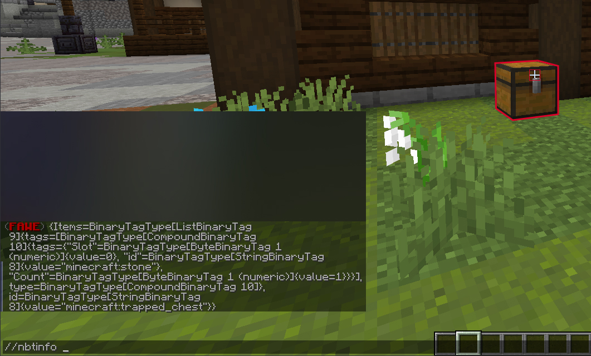
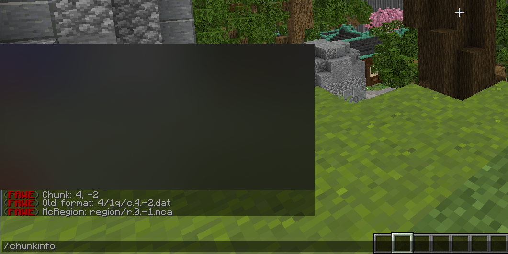
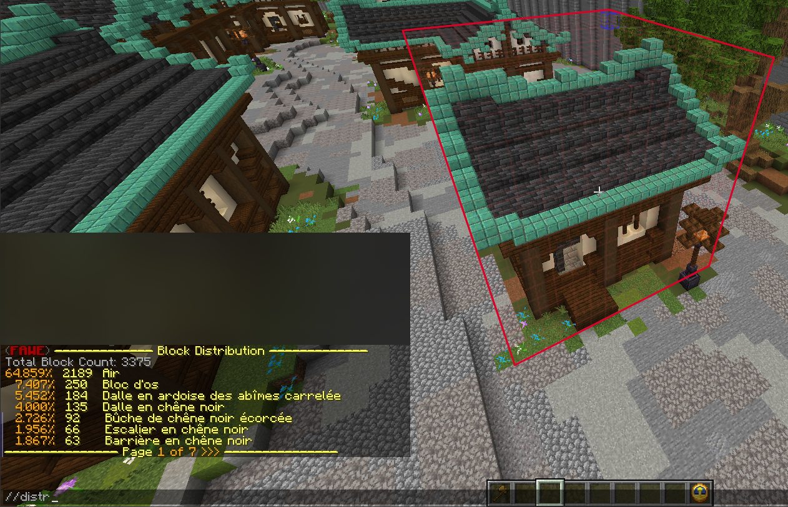
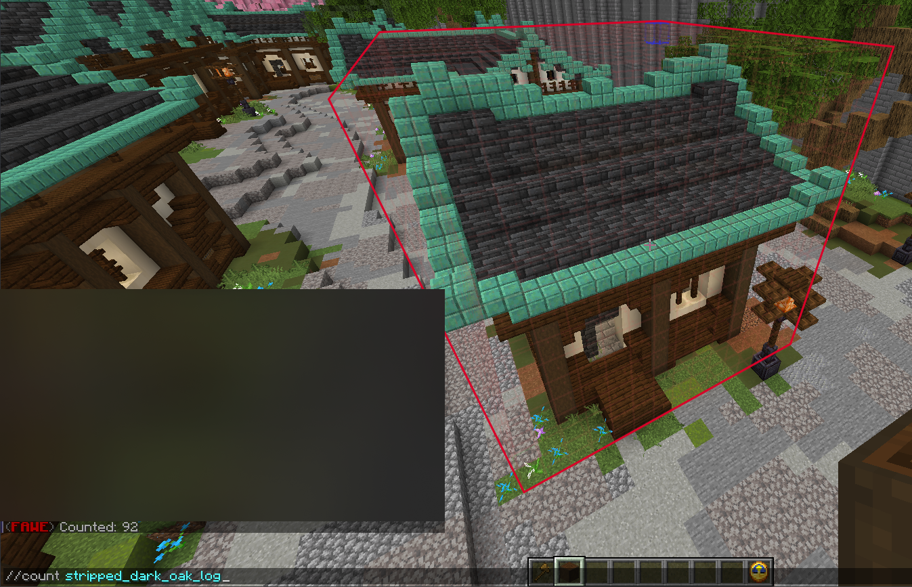

# Analyse

Raccourcie

<table data-view="cards"><thead><tr><th align="center"></th><th align="center"></th><th align="center"></th></tr></thead><tbody><tr><td align="center">//Nbtinfo</td><td align="center"><code>//nbtinfo</code></td><td align="center">

Information conteneur
</td></tr><tr><td align="center">//chunkinfo</td><td align="center"><code>//chunkinfo</code></td><td align="center">

Info par chunk
</td></tr><tr><td align="center">//distr</td><td align="center"><code>//distr [-c] [-d] [-p &#x3C;page>]</code></td><td align="center">Distribution de bloc</td></tr><tr><td align="center">//count</td><td align="center"><code>//count &#x3C;block></code></td><td align="center">Compte</td></tr><tr><td align="center">//size</td><td align="center"><code>//size [-c]</code></td><td align="center">Mesure </td></tr></tbody></table>

## Nbtinfo

* Affiche les informations [NBT](https://minecraft.fandom.com/fr/wiki/Format\_NBT) de la cible exemple [Coffre](https://minecraft.fandom.com/fr/wiki/Coffre) ou  [Fourneau](https://minecraft.fandom.com/fr/wiki/Fourneau) dans votre [viseur](https://minecraft.fandom.com/fr/wiki/Interface\_utilisateur#La\_croix) sous forme de chaîne de caractères lisible (texte brut).&#x20;
* L'utilisation : `//nbtinfo`

<figure><figcaption></figcaption></figure>

## Chunkinfo

* Affiche les informations sur le [Tronçons](https://minecraft.fandom.com/fr/wiki/Tron%C3%A7on) dans lequel vous êtes.
* Utilisation : `//chunkinfo`

<figure><figcaption></figcaption></figure>

## Distr

* Affiche la distribution des [blocs](https://minecraft.fandom.com/fr/wiki/Blocs) dans la sélection avec le pourcentage de distribution, le nombre et le nom du bloc traduit dans votre langue de jeu.
* Utilisation : `//distr` ou `//distr [-c] [-d] [-p <page>]`

<figure><figcaption></figcaption></figure>

## Count

* Affiche le nombre de [blocs](https://minecraft.fandom.com/fr/wiki/Blocs) d'un certain type dans votre sélection.
* Utilisation : `//count <block>`

<figure><figcaption></figcaption></figure>

## Size

* Affiche différentes mesures et autres informations sur votre sélection.
* Utilisation : `//size [-c]`
* Exemples visuels : Analyse d'une sélection, Analyse d'un clipboard, Analyse d'un schématics

<figure><figcaption></figcaption></figure>

### Analyzing a clipboard 

*   Utilisation : `//size -c`

* numéro de la liste de clipboard,&#x20;
* dimensions d'un cuboïde en longueur,&#x20;
* hauteur et largeur,&#x20;
* position de votre copie (important pour l'offset du schématique),&#x20;
* nombre de blocs (avec AIR).

<figure><figcaption></figcaption></figure>

### Analyzing a schematic 

*   Utilisation : `//size -c`

* nom du schématique
* dimensions d'un cuboïde en longueur
* hauteur et largeur
* offset du schématique (distance entre un coin et votre position de sauvegarde)
* nombre de blocs (avec AIR)

<figure><figcaption></figcaption></figure>


le lien vers le site pour analyse \[[ici](https://intellectualsites.github.io/fastasyncworldedit-documentation/basic-commands/analysis.html)]&#x20;

